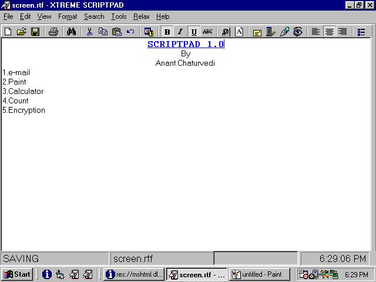



## SCRIPTPAD 1\.0

### Description

The SCRIPTPAD 1.0 is a more flexible Word Processor than most I have seen(on this site and elsewhere),though it doesn't support MDI Interface yet(I am working on it).

This Word Processor has more than the conventional tools and utilities then most.It out does the others with the following points:-

1.The SCRIPTPAD 1.0 has its own inbuilt e-mail facility for sending e-mail.

2.It has an inbuilt calculator.

3.It has an inbuilt graphic viewer and editor(something like paint but not as powerful).

4.It has an encryption utility.

5.It has tools to count the number of words or lines.

6.It has options to change text to UPPER CASE or lowercase.

7.It has superscripting and subscripting utilities.

8.It has a small inbuilt program that,if used correctly,can be used to draw fractal like drawings(see included '.rtf' file for tips).

9.It has protection against accidental data loss.

10.It is very user friendly.

To my knowledge this program contains no bugs,but if you do find them please contact me at my e-mail address anant_ch_15@yahoo.com .(there is a small and insignificant but unnoticible problem in the program to which I had to use weired programming techniques to correct,if you find an alternative then please contact me.)

Any suggestions and comments are welcome at my e-mail address, and please use my source code and vote for me.
 
### More Info
 

             |
---                |---
**Submitted On**   |2000-04-30 18:29:26
**By**             |[Anant Chaturvedi](https://github.com/Planet-Source-Code/PSCIndex/blob/master/ByAuthor/anant-chaturvedi.md)
**Level**          |Intermediate
**User Rating**    |3.9 (35 globes from 9 users)
**Compatibility**  |VB 5\.0, VB 6\.0
**Category**       |[Encryption](https://github.com/Planet-Source-Code/PSCIndex/blob/master/ByCategory/encryption__1-48.md)
**World**          |[Visual Basic](https://github.com/Planet-Source-Code/PSCIndex/blob/master/ByWorld/visual-basic.md)
**Archive File**   |[CODE\_UPLOAD52524272000\.zip](https://github.com/Planet-Source-Code/anant-chaturvedi-scriptpad-1-0__1-7617/archive/master.zip)

